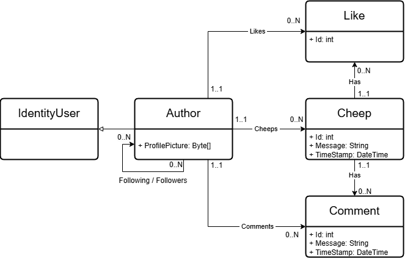
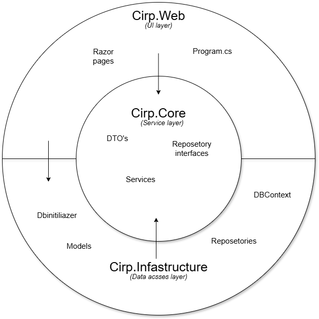
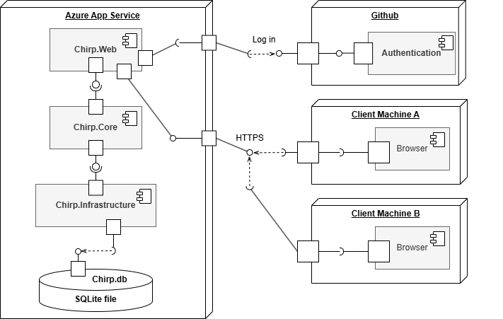
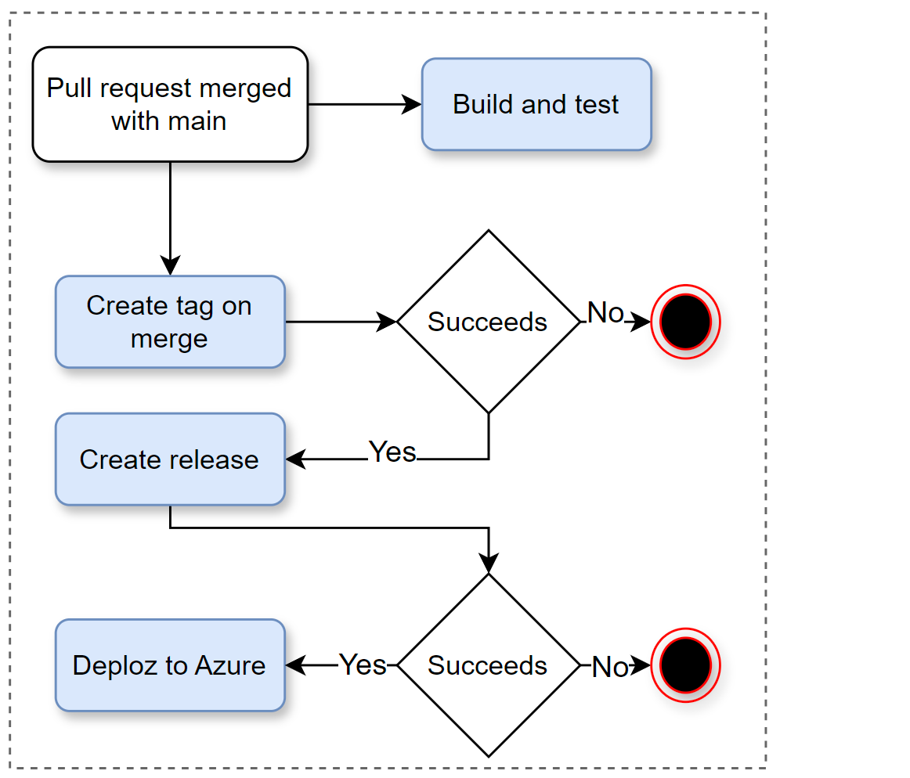
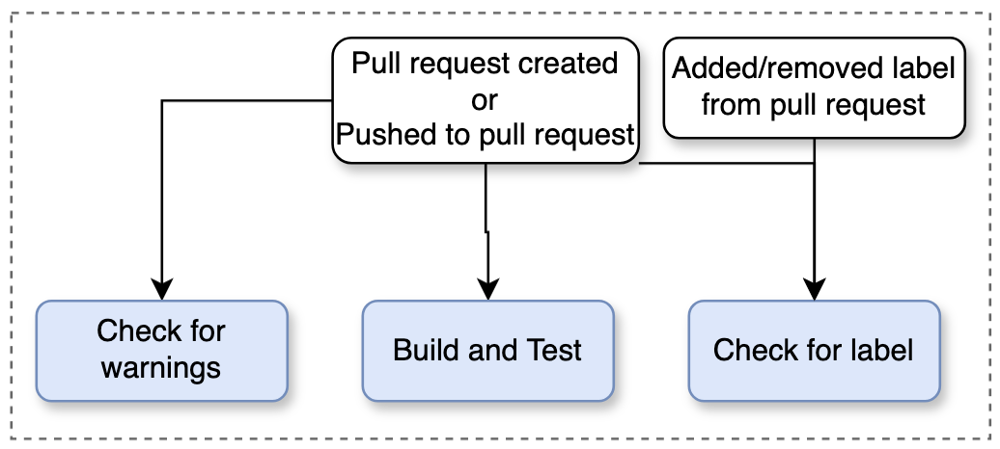
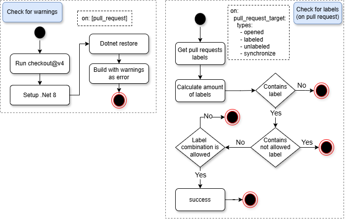
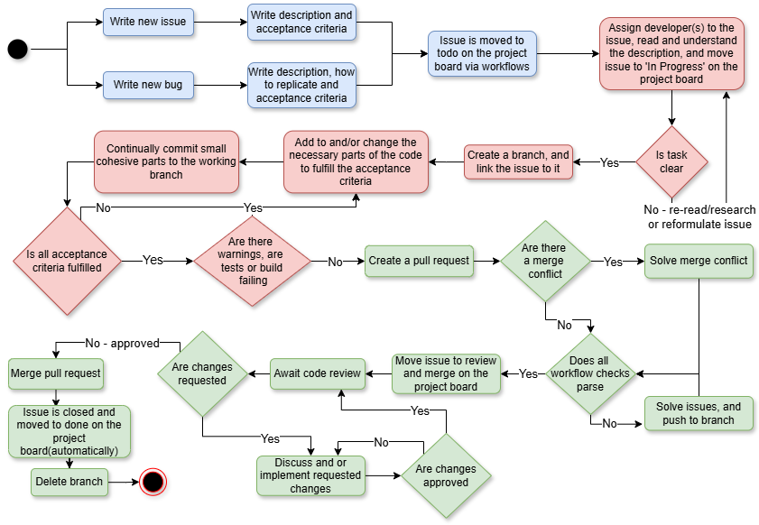

\begin{center}
\includegraphics[width=0.5\textwidth]{images/icon1.png}
\end{center}

\pagebreak

\tableofcontents

\pagebreak

# Design and Architecture of _Chirp!_

## Domain model

The _Chirp!_ domain model is set up around the Author class. Authors inherit traits for account management from IdentityUser. 
Authors are able to create Cheeps and interact with them with Likes or Comments. Each Author keeps a list of Likes and Comments
enabling logging of which Authors have interacted with which Cheeps. Furthermore Authors are able to follow other Authors, 
storing a list of Authors they follow and Authors that follow them.



\pagebreak

## Architecture — In the small

Due to the application's size, each layer consists only of a single project, as highlighted in bold. **Chirp.Web** references **Chirp.Infrastructure**, which deviates from the Onion architecture for two reasons:

1. **Program.cs** requires it to configure services.

2. ASP.NET Identity uses it for user registration and verification.



\pagebreak

## Architecture of deployed application

The _Chirp!_ application is deployed to the Microsoft Azure App Service as a complete component 
consisting of Chirp.Web for the GUI, with Chirp.Infrastructure handling the domain model and repositories.
The User connects to Chirp.Web through Azure. On read and write requests, the Azure Web App will
make calls to the deployed SQLite server. If users attempt to login or register with OAuth via Github,
Chirp.Web will make calls to GitHub Authentication. 



## User activities

In order to increase the readability of the UserActivities diagram, the full diagram has been decomposed 
to show activities depending on whether the User is signed in or not. 

The full diagram can be seen under _docs/images/UserActivitiesDiagram.png_

\pagebreak

\vspace*{-4cm}
\noindent
\hspace*{-2cm}
\makebox[\textwidth][l]{%
    \includegraphics[width=1.35\textwidth, height=\textheight, keepaspectratio]{images/LoggedOut.png}
}

\vspace*{0.5cm}
\captionof{figure}{Illustration of the \textit{Chirp!} functionality while signed out.}
\vspace*{2.5cm}
\vspace*{-2cm}
\noindent
\hspace*{-2cm}
\makebox[\textwidth][l]{%
    \includegraphics[width=1.25\textwidth, height=\textheight, keepaspectratio]{images/LoggedIn.png}
}

\vspace*{0.05cm}
\captionof{figure}{Illustration of the \textit{Chirp!} functionality while signed in.}

\pagebreak

## Sequence of functionality/calls trough _Chirp!_

\noindent
\hspace*{-2cm}
\makebox[\textwidth][l]{%
    \includegraphics[width=1.4\textwidth, height=\textheight, keepaspectratio]{images/Sequence-of-functionality.png}
}
\vspace*{0.5cm}
\captionof{figure}{Sequence diagram of the flow of messages through the \textit{Chirp!} application.}


\pagebreak 

# Process


## Build, test, release, and deployment


Figure 5 below illustrates the workflows used for building and deploying the _Chirp!_ application.
The process starts when a pull request is merged into the main branch.
The blue boxes represents workflows.




\vspace*{-2cm}
\noindent
\hspace*{-2cm}
\makebox[\textwidth][l]



\pagebreak

## Team work
### Project Board


### Unclosed Issues
Some issues still remain open in the Todo column. These are a combination of features that the group found interesting but did not get to implement within the time frame of the project work, such as bugs, refactors and documentation.
&nbsp;

In order to better mimic the functionality of _X_ (f.k.a _Twitter_), users should be able to leave comments directly on the timeline pages. 
This would be implemented by having a popup window appear, where users could leave comments, when clicking a Cheep. 
However getting this to work while handling and displaying message-format-errors proved to be an issue, and the feature was given an _Extra_ tag and left open. 
\vspace*{0.3cm}

We also wanted to make a big refactor, which involved moving what database access we could to an API project. Since we use ASP.NET Identity for user registration and verification, a local database would still be required for the web project to store user information. The main reason for the API project is to decouple data access from the web application, making it easier to build additional features, such as a mobile app, by enabling shared data across projects. While a centralized database could achieve similar results, an API is more future-proof, as it abstracts the database layer, making the switching of the database, have no impact on the projects using the API.
\vspace*{0.3cm}

There is also some extra functionality left, e.g. a theme song, as well as a feature for better display of the users data, and a bug regarding the timestamp on comments. The rest of the issus are regarding refactors for better code quality or in code ducumentation and naming consistensy through the code.

\vspace*{0.3cm}

For the Command-Line-Interface version of _Chirp!_, an error with the end-to-end tests still exists. 
The tests pass when the database file contains the expected Cheep and the test is run on Windows.
However the group was unable to make the test work in isolation from the actual database and cross-platform and thus the end-to-end-test branch remains open. 

### Issue Progression 
The illustration below shows how the group worked with issues during the project. 
Steps highlighted in blue show issue creation, red boxes show the development process
and green how issues are merged from the feature branch into main.



\pagebreak

## How to make _Chirp!_ work locally
First clone the repository to your machine with:

\vspace*{0.5cm}
```
git clone https://github.com/ITU-BDSA2024-GROUP10/Chirp.git
```
\vspace*{0.5cm}

In order for the program to work, you will need to configure the user-secrets. 
To do this navigate to  _/Chirp/Chirp_, in the terminal, and run:

\vspace*{0.5cm}
Windows:

```
dotnet user-secrets init --project .\src\Chirp.Web\
dotnet user-secrets set "authentication:github:clientId" "Ov23lisGJEMdXORhzpDr" 
--project .\src\Chirp.Web\

dotnet user-secrets set 
"authentication:github:clientSecret" "a9229ceee8bb014070dc9abe892cf07d7aba4d0d" 
--project .\src\Chirp.Web\

```

\vspace*{0.5cm}
MacOs & Linux:


```
dotnet user-secrets init --project ./src/Chirp.Web/
dotnet user-secrets set "authentication:github:clientId" "Ov23lisGJEMdXORhzpDr" 
--project ./src/Chirp.Web/

dotnet user-secrets set 
"authentication:github:clientSecret" "a9229ceee8bb014070dc9abe892cf07d7aba4d0d" 
--project ./src/Chirp.Web/

```
\vspace*{0.5cm}
Next navigate to _/Chirp/Chirp/src/Chirp.Web_ and in your terminal do either:
\vspace*{0.5cm}
```
dotnet watch 
```


```
dotnet run 
```

## How to run test suite locally

In order to run the UI-Tests, make sure that your system has Playwright installed.

Next, navigate to _/Chirp/Chirp_ and in your terminal do
\vspace*{0.5cm}
```
dotnet test 
```

\pagebreak

## Our test structure
We have three kinds of test

- Unit

- UI

- End to end

&nbsp;

Since our services are essentially return statements calling our repository, we found integration tests of these to be of lesser value compared to the rest of the project. However, were the project to continue, testing them would be beneficial to ensure functionality remains unchanged as the services evolve.
\vspace*{0.3cm}

Most of the unit tests are on the repository methods since these are where almost all of the compute is being done. 

\vspace*{0.3cm}
Our UI tests setup is quite general. Nothing is mocked, an in-memory database is used, the only validation is for if the UI behaves as expected. 
We could, in addition to these, have done some tests where we isolate the UI more, e.g., by mocking the behavior of the used service methods. But we prioritized other tasks given the application's size.
We have some end-to-end tests, but could probably use some more. Since our UI tests are so general, they act to some degree as end to end tests.

# Ethics

## License

This program is licensed with the GNU GENERAL PUBLIC LICENSE Version 3.
For the dependincies used, they either have an MIT or an Apache-2.0 license.
And since we only use Duende Identity server for testing purposes, a license is not required,
as stated at the bottom of, https://duendesoftware.com/products/communityedition

## LLMs, ChatGPT, CoPilot, and others

### CoPilot
Github CoPilot has been used doing the development of this project. It has been a great tool for speeding up development, as it is quicker to read through the code it recommends than to write it. Not everything it recommends is usable or as desired, but it can also help when learning a new language or framework to introduce new methods and structure.

\pagebreak

### ChatGPT
ChatGPT was used primarily for the three following things.

- Understanding and debugging error messages

- Writing some HTML and CSS code

- Understanding and discussing code
&nbsp;

**Understanding and debugging error messages.**
An LLM is ideal here since error messages can be very long and contain a lot of information. 
Sometimes, they can also be harder to understand if one doesn't have a lot of knowledge of the framework being used. 
&nbsp;

**Writing some HTML and CSS code.**
Since HTML and CSS is time consuming, we used ChatGPT to help write some of the UI code that could then be fine tuned by hand.   
&nbsp;

**Understand and discussing code.**
This can be very helpful when others are not available, especially when finding code online, for example from Stack Overflow or documentation. When learning a new language or framework, this can especially be helpful, since you don't know a lot of the tricks yet.  
&nbsp;

Overall, the use of LLM's sped up our development process, and helped us get a better understanding of C# and .NET. 
While using LLM's can help speed up debugging and development processes, it is still important to learn how to work independent of AI-assistance.
The data centers running the models also consume large amounts of energy, and as a developer you need to be conscious of the impact of this technology. 
