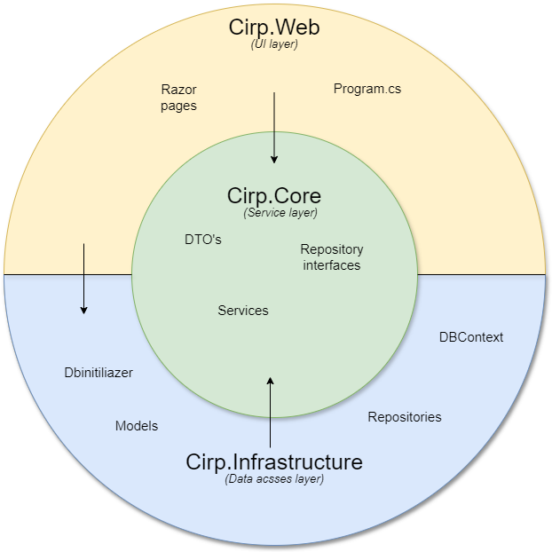

\begin{center}
\includegraphics[width=0.5\textwidth]{images/icon1.png}
\end{center}

\pagebreak
# Design and Architecture of _Chirp!_

## Domain model

The _Chirp!_ domain model is setup around the Author class. Authors inherit traits for account management from IdentityUser. 
Authors are able to create Cheeps and interact with them with Likes or Comments. Each Author keeps a list of Likes and Comments
enabling logging of which Authors have interacted with which Cheeps.

## Architecture — In the small

## Architecture of deployed application

## User activities

## Sequence of functionality/calls trough _Chirp!_

# Process

## Build, test, release, and deployment

## Team work

## How to make _Chirp!_ work locally

## How to run test suite locally

# Ethics

## License

## LLMs, ChatGPT, CoPilot, and others
